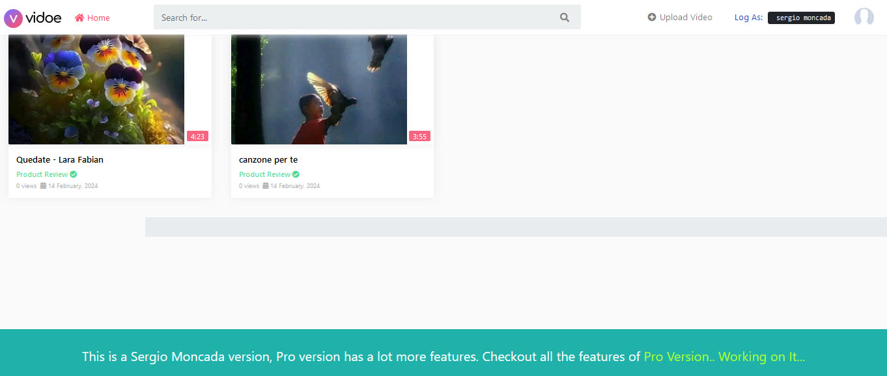
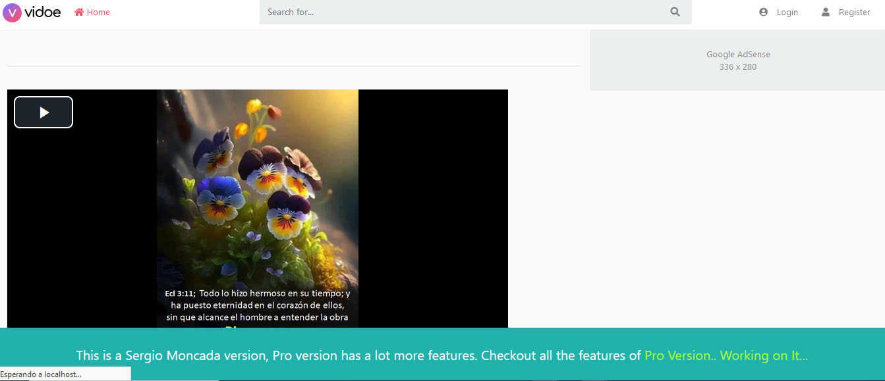
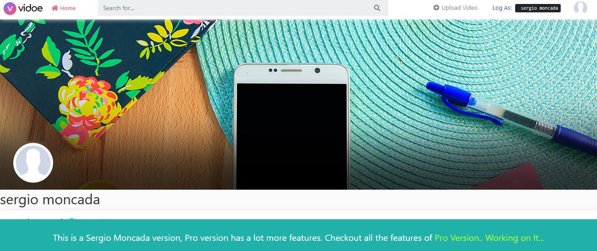
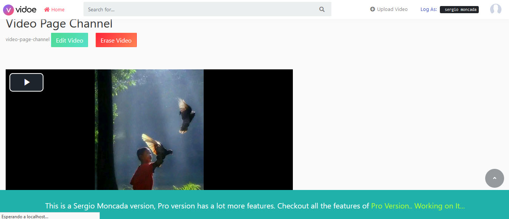
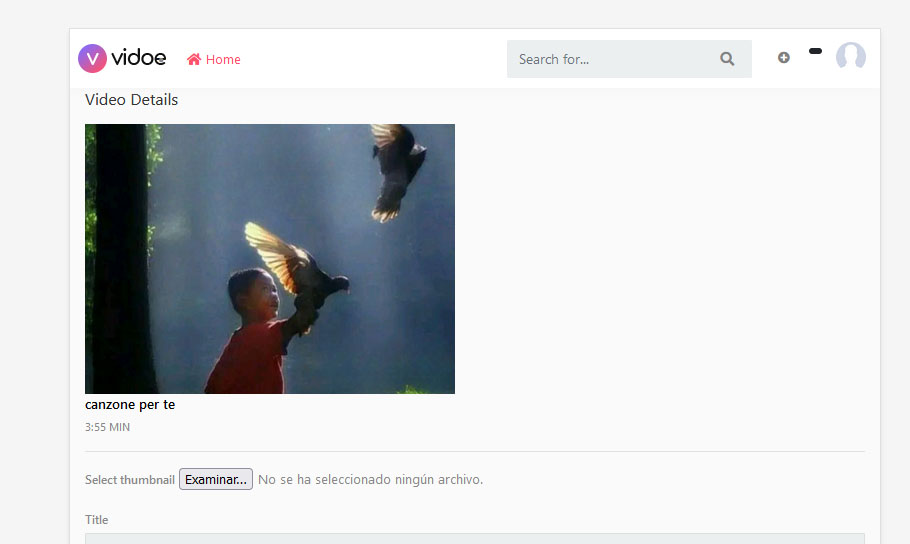

<h1 align ="center" > 📽️  Video Stream </h1>
<h4  align ="center"> 
Fullstack open source application, dynamic website with features like NodeJS and HTML5 Video Streaming,</h4>
 <h4  align ="center">Personal Channel, user dashboard, authentication and more.  Made with MongoDB, Express, Nodejs  </h4>
<br>
<br>

  * [Configuration and Setup](#configuration-and-setup)
  * [Key Features](#key-features)
  * [Technologies used](#technologies-used)
      - [Frontend](#frontend)
      - [Backend](#backend)
      - [Database](#database)
  * [📸 Screenshots](#screenshots)
  * [Author](#author)
  * <br>
  * ## ⚙️ Configuration and Setup

In order to run this project locally, simply fork and clone the repository or download as zip and unzip on your machine.

- Open the project in your prefered code editor.
- Go to terminal -> New terminal (If you are using VS code)

```
$ cd client
$ npm install (to install client-side dependencies)
$ npm run  start (to start the client)  or nodemon app
DONT FORGET TO CREATE THE IMAGE FOLDER - ./public/thumbnails - ./public/videos
```
```

```


##  🔌 Technologies used ✔️:


##  Screenshots:
📸
<br>






<br>

##  Key Features:

Authentication: 👓

    User sign up and login with email and password
    Admin login using admin credentials
    Password Reset

User Mode

    The website consists of a portal for keeping people updated about the latest opportunities in different fields. These posts could be looked up category wise by clicking on the category and also allows the user to navigate from one category to another. After logging in the user can also submit an opportunity using a form, which would be reviewed by the admin (using admin dashboard in the admin mode) before posting.
    It consists of another section for holding discussions and bringing into light importance issues. The users could submit posts which after being reviewed by admin appear in the explore section of the website. The posts support like and comment features on logging in.

Admin Mode

    Consists of an admin dashboard which allows the admin to approve or delete the submitted posts/opportunity.
    Provides admin access to edit/delete feature on all posts and comments.

Authorization:

    User can submit a post/opportunity and comment after logging in.
    Admin can manage,approve , edit and delete all posts and opportunities

Displaying flash messages for responding to user's interaction with the application.
MongoDB
<br/>

##  Technologies used

📋 This project was created using the following technologies.

####  Frontend 

- [EJS ](https://www.npmjs.com/package/react) - JavaScript library that is used for building user interfaces and backend servers specifically for single-page applications
- [React Toastify](https://www.npmjs.com/package/react-toastify) - To display interactive and responsive notifications (toasts) in web applications

####  Backend 

- [Node js](https://nodejs.org/en/) -A runtime environment to help build fast server applications using JS
- [Express js](https://www.npmjs.com/package/express) -The server for handling and routing HTTP requests
- [Mongoose](https://mongoosejs.com/) - For modeling and mapping MongoDB data to JavaScript
- [jsonwebtoken](https://www.npmjs.com/package/jsonwebtoken) - For authentication
- [cookie-parser](https://www.npmjs.com/package/cookie-parser) - Middleware module used in Node.js web applications to manage cookies
- [cors](https://www.npmjs.com/package/cors) - Provides a Connect/Express middleware
- [Dotenv](https://www.npmjs.com/package/dotenv) - Zero Dependency module that loads environment variables
- [express-validator](https://www.npmjs.com/package/express-validator) - Used in Node.js applications with the Express framework to validate data submitted by users (user input)
- [nodemon](https://nodemon.io/) - Development utility for Node.js applications. Node.js is a runtime platform that allows you to run JavaScript on the server side.t
- [Multer] - Handle Images

####  Database 

 - [MongoDB ](https://www.mongodb.com/) - It provides a free cloud service to store MongoDB collections.💾

## Author
     👨🏻‍🏫 
- Portfolio: 
- Github: 
- Sponsor: 
- Linkedin:https://www.linkedin.com/in/sergio-moncada-72589883/
- Email: :mailbox_with_mail:[sergiogmoncada@yahoo.com](mailto:sergiogmoncada@yahoo.com)

